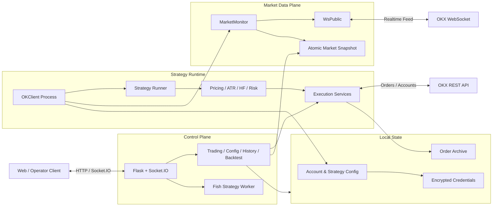

<div align="center">

# Balance

### Event-Driven Digital Asset Strategy Engine

**面向 OKX REST / WebSocket 的多策略研究、执行与管理后端**


</div>

---

## Overview

Balance 是一个事件驱动的数字资产策略交易后端，将实时行情接入、策略运行时、风险约束、订单执行、历史归档和管理 API 组织为相互独立的模块。

项目采用双进程职责划分：

- `server.py` 提供 Flask / Socket.IO 管理面、交易接口、配置接口、历史统计与回测能力。
- `ok/OKClient.py` 负责行情订阅、策略实例调度、信号计算和交易执行。

代码覆盖从市场数据进入到订单落地的完整技术链路，适合用于策略工程、交易系统架构和实时数据处理研究。

> [!IMPORTANT]
> 当前仓库是经过脱敏的公开技术演示版本，不包含默认账户、真实 API 凭据或可直接投入实盘的配置。`users` 与 `admins` 默认均为空。

## Highlights

| Domain | Capability |
| --- | --- |
| Market Data | OKX 公共 WebSocket、REST 行情、深度与 K 线订阅、动态交易对管理 |
| Strategy Runtime | K 线 / 马丁、ATR、高频组合交易、fish 订单策略 |
| Synthetic Markets | 现货与永续组合交易对、双腿行情合成、跨标的价格计算 |
| Execution | 下单、批量撤单、即时成交、双腿执行、订单结果校验 |
| Risk Control | 仓位上限、方向约束、策略互斥、参数规范化与运行状态控制 |
| Persistence | 行情快照、订单本地归档、增量读取、月度与周度统计 |
| Control Plane | Flask API、Socket.IO 推送、配置管理、日志流与活跃会话 |
| Research | 历史回测、ATR 回测、统计分析与策略参数试验 |

## Architecture



## Runtime Model

### Control Plane

`server.py` 注册四组 Blueprint，并通过 Socket.IO 提供实时管理通道：

- **Trading**：账户概览、挂单、下单、撤单、服务控制与日志查询。
- **Configuration**：策略参数、交易对、高频配置、凭据字段与运行状态。
- **History**：订单归档、分页历史、月度与周度结果统计。
- **Backtest**：常规策略与 ATR 回测、研究数据和笔记接口。

### Strategy Plane

`ok/OKClient.py` 按账户和交易对构建客户端实例，通过 gevent 启动相互隔离的策略循环：

1. 载入账户级配置与策略参数。
2. 注册深度、K 线和组合交易对行情。
3. 初始化定价、统计、风险与策略状态。
4. 运行信号计算和订单管理循环。
5. 将订单、行情与统计状态持久化到本地运行目录。

### Market Data Plane

`market/MarketMonitor.py` 统一管理行情订阅和快照发布：

- WebSocket 优先，支持 REST 模式补充。
- 独立维护 K 线、盘口和组合交易对数据。
- 通过原子替换发布行情快照，避免读取半写入状态。
- 支持动态增加或移除订阅标的。
- 为高频组合策略合成双腿 bid / ask 行情。

## Engineering Design

- **事件驱动行情**：使用独立 asyncio WebSocket 线程消费实时市场数据。
- **协作式并发**：使用 gevent 组织策略循环，并将阻塞 REST 请求卸载到扩展线程池。
- **请求并行化**：余额、持仓、限价和历史行情等互不依赖的网络往返并行执行。
- **连接复用**：API 实例按账户和业务类型缓存，保留底层 HTTP 连接池。
- **快照一致性**：行情文件通过原子发布与版本缓存提供一致读取视图。
- **增量归档**：订单历史按版本和文件尾部增量加载，降低重复解析成本。
- **紧凑序列化**：高频数据路径使用 `orjson`，大体积月度历史响应按需 gzip。
- **分层策略实现**：定价、风险、统计、市场与执行逻辑分别位于 core 和 services 层。

## Repository Map

```text
balance/
├── api/                    # OKX REST 与 WebSocket 客户端
│   ├── okex_sdk_v5/        # REST API 封装
│   └── websocket/          # 公共行情连接、重连与订阅
├── market/                 # 行情订阅、组合价格与快照持久化
├── trader/
│   ├── app/                # 策略进程引导与主循环
│   ├── core/               # 定价、风险、统计与策略实现
│   └── services/           # 账户、执行、行情、配置和通知
├── routes/                 # Flask API、Socket.IO 与交易工作流
├── ok/                     # OKX 策略进程入口
├── module/                 # 客户端装配、日志、信号与运行环境
├── util/                   # 加密、认证、归档与通用工具
├── server.py               # Control Plane 入口
└── requirements.txt
```

## Strategy Portfolio

### K-Line / Martingale

基于 K 线窗口、趋势条件、价格间隔和仓位参数维护交易状态，可配置冷却周期、放大系数、止盈和限仓条件。

### ATR

使用 ATR 价格区间、能量状态、买卖档位和收益统计驱动订单决策，并在初始化阶段校验与其他策略的互斥关系。

### High Frequency Pair Trading

面向组合现货与组合永续标的：

- 合成两条基础市场的实时 bid / ask。
- 维护买卖档位、持仓、手续费和收益状态。
- 按交易对类型拆分双腿订单。
- 支持顺序执行与成交结果校验。

### Fish Orders

围绕目标区间、价格间隔、反向补单和过期订单重建维护订单网格，并复用统一的风险与执行服务。

## Configuration & Secrets

仓库不包含运行凭据。以下文件默认由 `.gitignore` 排除：

- `key.ini`、`key.bak`、`auth.ini`
- `ok/*.ini`、`market.ini`、`fishnet*.ini`
- `order/`、`db/`、日志和运行时状态

核心环境变量：

| Variable | Purpose |
| --- | --- |
| `MARTIN_FERNET_KEY` | 本地凭据文件的 Fernet 派生主密钥 |
| `MARTIN_MARKET_USER` | 交易进程使用的行情账户标识 |
| `FLASK_SECRET_KEY` | Flask 会话和服务密钥 |
| `MARTIN_KEY_PATH` | 覆盖 `key.ini` 路径 |
| `MARTIN_AUTH_PATH` | 覆盖 `auth.ini` 路径 |
| `MARTIN_DATA_DIR` | 覆盖运行数据根目录 |
| `MARTIN_MARKET_CONFIG_PATH` | 覆盖行情账户配置路径 |
| `MARTIN_MARKET_PATH` | 覆盖行情快照路径 |
| `MARTIN_NOTIFICATION_USER` | 可选的安全通知账户 |
| `SMTP_HOST` / `SMTP_USER` / `SMTP_PASSWORD` | 可选的邮件通知配置 |

建议使用稳定、随机且仅由运行环境注入的 `MARTIN_FERNET_KEY` 与 `FLASK_SECRET_KEY`，禁止将它们写入仓库、Shell 历史或镜像层。

### Minimal Auth State

服务导入时需要一个本地 `auth.ini` 保存会话容器：

```ini
[sids]
data = {}

[masks]
data = {}
```

该文件只初始化运行状态，不会创建登录账户。公开版本中的允许用户和管理员列表为空，需要使用者在受控环境中自行完成账户接入。

## Quick Start

### 1. Prepare Environment

```bash
git clone https://github.com/suishanwen/balance.git
cd balance

python3 -m venv .venv
source .venv/bin/activate
python3 -m pip install -r requirements.txt

export PYTHONPATH="$PYTHONPATH:$(pwd)"
export MARTIN_FERNET_KEY="<runtime-secret>"
export FLASK_SECRET_KEY="<runtime-secret>"
```

### 2. Initialize Local State

创建被 Git 忽略的 `auth.ini`，并根据研究环境准备账户凭据与策略配置。真实 API Key 应使用独立测试账户、最小权限和 IP 白名单。

### 3. Start the Control Plane

```bash
python3 server.py
```

默认监听：

```text
http://0.0.0.0:5555
```

健康检查：

```bash
curl http://127.0.0.1:5555/test
```

### 4. Start the Strategy Runtime

完成本地账户配置后，从 `ok/` 目录启动交易进程：

```bash
export MARTIN_MARKET_USER="<market-account>"
cd ok
python3 OKClient.py
```

> [!CAUTION]
> 策略运行时包含真实下单、撤单和服务控制路径。请先在隔离账户、模拟参数或受控网络中验证，不要直接使用主账户凭据。

## API Surface

| Group | Representative Capabilities |
| --- | --- |
| Trading | 账户与持仓、挂单、下单、批量撤单、即时成交 |
| Configuration | 单账户与多账户参数、交易对、高频配置、运行状态 |
| History | 订单归档、分页历史、月度与周度统计 |
| Research | 常规回测、ATR 回测、研究数据读取 |
| Realtime | 行情、日志、刷新事件和活跃连接推送 |
| Operations | 策略重载、启停、配置更新与状态查询 |

绝大多数业务接口要求会话和读写权限。公开版本没有默认可用账户。

## Operational Boundaries

- 不提交任何账户配置、日志、订单文件或运行时状态。
- 不将 Flask / Socket.IO 服务直接暴露到不可信公网。
- 使用反向代理、网络隔离和最小权限 API Key 控制访问边界。
- 修改策略参数前先验证仓位上限、手续费、合约面值和交易对精度。
- 保留订单、错误和策略状态日志，以便复盘异常交易路径。
- 本项目没有承诺高可用、灾备或托管资金安全能力。

## Disclaimer

本项目仅用于软件工程研究、策略实验与内部技术验证，不构成投资建议、收益承诺或交易服务。自动交易可能受到网络延迟、接口变更、流动性、滑点、配置错误和策略失效等因素影响。使用者应自行评估并承担账户与资金风险。

---

<div align="center">

**Market data · Strategy runtime · Risk control · Execution · Research**

</div>
